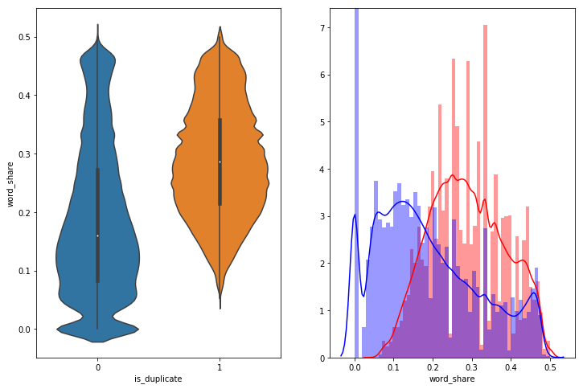
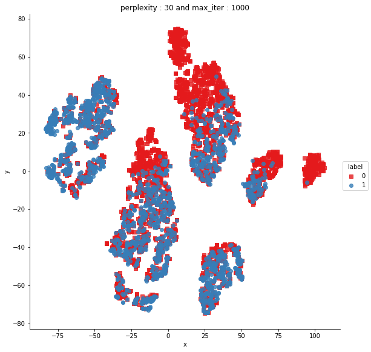
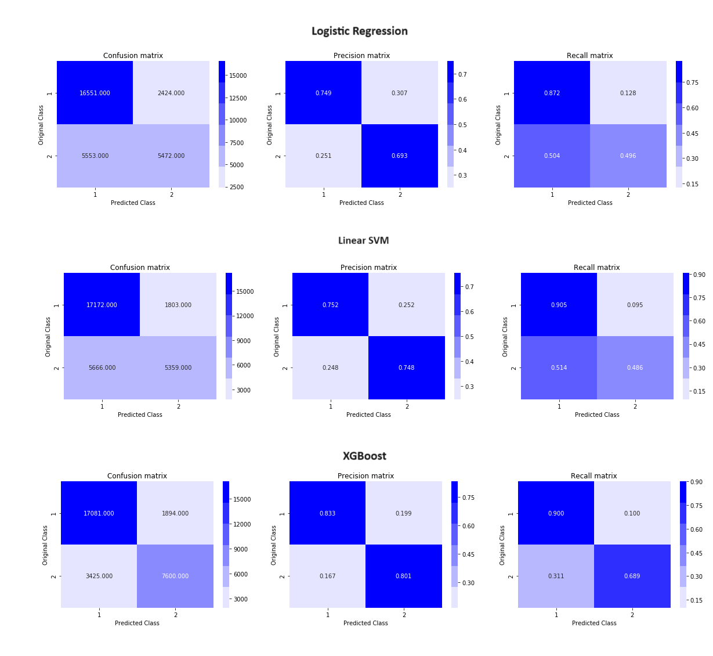

# ML_Question_Pairing
A repository that contains ML algorithms and processing on a question-paring dataset from Kaggle (Text Processing, Categorical Encoding, Advanced Feature Engineering, Binary Classification).

Used packages:

| Seaborn | Matoplotlib | Pandas | Math    |
|---------|-------------|--------|---------|
| Numpy   | Sklearn     | os     | mlxtend |
| nltk    | Collections | Scipy  | Plotly  |
| worldcloud    | tqdm | Sqlite3  | xgboost  |
| datetime    | sqlalchemy | re  | fuzzywuzzy  |
| bs4    |  |   |   |

Built Classifiers:
* Logistic Regression (LR)
* Support Vector Machine (SVM)

Files:

| File Name       | Description                                                                                                                                                                                                       |
|-----------------|-------------------------------------------------------------------------------------------------------------------------------------------------------------------------------------------------------------------|
| explore.py | Explore the downloaded files and perform initial preprocessing such as cleaning, preprocessing text, and merging files.                                                                                                |
| text_process.py | Perform advanced preprocessing and feature engineering features such as common-word-count (CWC), common-token-count (CTC), and common-stop-count (CSC) with their ratios utilizing wordcloud and fuzzywuzzy packages which help in text matching and similarity.                                                        |
| word2vec.py  | Take the training set of the data and vectorize the text using spacy GLOVE model and TFIDDVector. |
| model_.py  | Take the vectorized store it in a SQLite DB and train the classifiers  while keeping in mind the model's interpretability and its predictive power. |
| functions_.py   | A file that acts as a central file for main functions used during the text preprocessing stage such as preprocessing and tokenization.                                                                  |

---

Dataset link on Kaggle: [Quora Question Pairs](https://www.kaggle.com/competitions/quora-question-pairs/)

The data that was preprocessed and trained belongs to the following file:
* train.csv.zip (ID, qid1, qid2, question2, question2, is_duplicated)

Contains the below information.

| Field Name | Description                                                              |
|------------|--------------------------------------------------------------------------|
| ID         | The id of a training set question pair |
| qid1, qid2       | Unique ids of each question (only available in train.csv)                         |
| question1, question2  | The full text of each question                              |
| is_duplicate      | The  target variable, set to 1 if question1 and question2 have essentially the same meaning, and 0 otherwise.|                                      |

---

Basic feature extraction was done before cleaning the data, it included the below.
- freq_qid1 = Frequency of qid1's
- freq_qid2 = Frequency of qid2's
- q1len = Length of q1
- q2len = Length of q2
- q1_n_words = Number of words in Question 1
- q2_n_words = Number of words in Question 2
- word_Common = (Number of common unique words in Question 1 and Question 2)
- word_Total =(Total num of words in Question 1 + Total num of words in Question 2)
- word_share = (word_common)/(word_Total)
- freq_q1+freq_q2 = sum total of frequency of qid1 and qid2
- freq_q1-freq_q2 = absolute difference of frequency of qid1 and qid2

The below ratios were computed in the text_process.py during advanced feature engineering.
- **cwc_min:** Ratio of common_word_count to min lenghth of word count of Q1 and Q2cwc_min = common_word_count / (min(len(q1_words), len(q2_words))
- **cwc_max:** Ratio of common_word_count to max lenghth of word count of Q1 and Q2cwc_max = common_word_count / (max(len(q1_words), len(q2_words))
- **csc_min:** Ratio of common_stop_count to min lenghth of stop count of Q1 and Q2csc_min = common_stop_count / (min(len(q1_stops), len(q2_stops))
- **csc_max:** Ratio of common_stop_count to max lenghth of stop count of Q1 and Q2csc_max = common_stop_count / (max(len(q1_stops), len(q2_stops))
- **ctc_min:** Ratio of common_token_count to min lenghth of token count of Q1 and Q2ctc_min = common_token_count / (min(len(q1_tokens), len(q2_tokens))
- **ctc_max:** Ratio of common_token_count to max lenghth of token count of Q1 and Q2ctc_max = common_token_count / (max(len(q1_tokens), len(q2_tokens))
- **last_word_eq:** Check if last word of both questions is equal or notlast_word_eq = int(q1_tokens[-1] == q2_tokens[-1])
- **first_word_eq:** Check if First word of both questions is equal or notfirst_word_eq = int(q1_tokens[0] == q2_tokens[0])
- **abs_len_diff:** Abs. length differenceabs_len_diff = abs(len(q1_tokens) - len(q2_tokens))
- **mean_len:** Average Token Length of both Questionsmean_len = (len(q1_tokens) + len(q2_tokens))/2

The text preprocessing steps included the following:
- Removing HTML tags.
- Removing Punctuation.
- Performing stemming.
- Removing Stopwords.
- Expanding contractions etc.

---

The distributions for normalized word_share do overlap on the far right-hand side (i.e. there are a lot of questions with high word similarity). The average word share and Common no. of words of qid1 and qid2 is more when they are duplicates (Similar).

After performing advanced feature engineering it can be noted that the data sample has less overlap in its distribution.

t-SNE (t-distributed Stochastic Neighbor Embedding):

---

While processing the data and training the model an approach was followed comparing the model's performance using multiple alpha's to help determine the best alpha (learning rate) to train the classifier on. To choose the best alpha hyperparameter for the model's training, various alphas were tested on the model, and the one that presented the lowest error measure (log loss) was selected. The below is the best alpha used for each of the models.

| Model                                             | Best Alpha |
|---------------------------------------------------|------------|
| LR    | 1      |
| SVM  (Linear)               | 0.0001       |

Log Loss comparison across train and test sets.

| Model                                             | Train Set Loss | Test Set Loss | Number of Data Points |
|---------------------------------------------------|----------------|---------------------------|---------------|
| LR    | 0.5138           | 0.5200                     | 30000          |
| SVM (Linear)                   | 0.4780           | 0.4896                      | 30000          |
| XGBoost                      | 0.3455           | 0.3570                      | 30000         |

It can be noted that the XGBoost model has the best performance in terms of the lowest error recorded (log loss) in both the training 34.55 (0.3455 x 100) and testing sets 35.70 (0.3570 x100) in comparison to other models used.

Reference:
- [Fuzzy Wuzzy String Matching](http://chairnerd.seatgeek.com/fuzzywuzzy-fuzzy-string-matching-in-python/)
